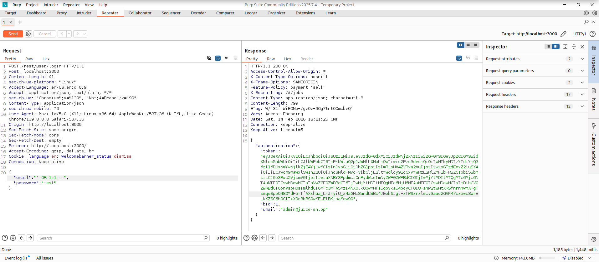
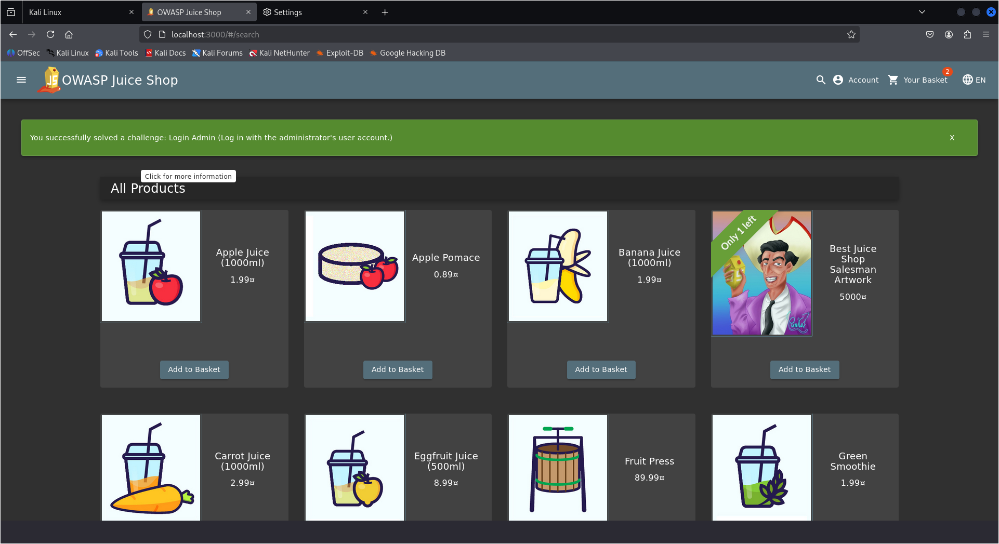
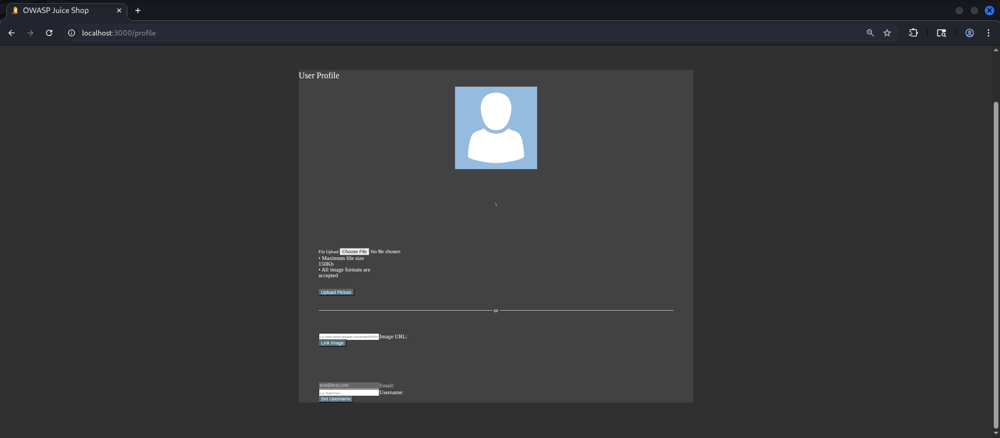

# 🌐 Web Application Security Assessment Lab

## Target Application
OWASP Juice Shop (Running Locally in Controlled Lab Environment)

---

# 🔴 SQL Injection – Authentication Bypass

## 📌 Vulnerability Summary

A SQL Injection vulnerability was identified in the login endpoint of the application.  
Improper input validation allows authentication bypass using crafted SQL payloads.

---

## 🎯 Affected Endpoint

---

## 🧪 Payload Used

' OR 1=1 --

---

## 📸 Proof of Concept

### 1️⃣ Injected Request

---

### 2️⃣ Server Response (Admin Token Issued)

---

### 3️⃣ Successful Admin Login

---

## 💥 Impact

- Authentication bypass
- Admin account takeover
- Privilege escalation
- Full application compromise

---

## 📊 Risk Rating

Severity: **Critical**  
Estimated CVSS Score: **9.8**

---

## 🛡 Recommended Remediation

- Use parameterized queries
- Implement prepared statements
- Apply ORM protections
- Validate and sanitize user input
- Implement server-side input filtering
