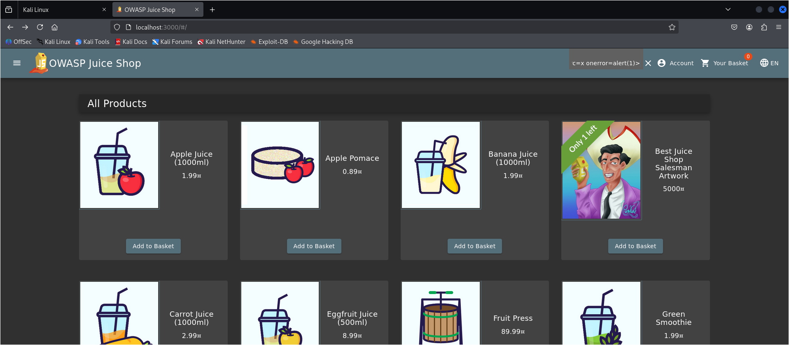
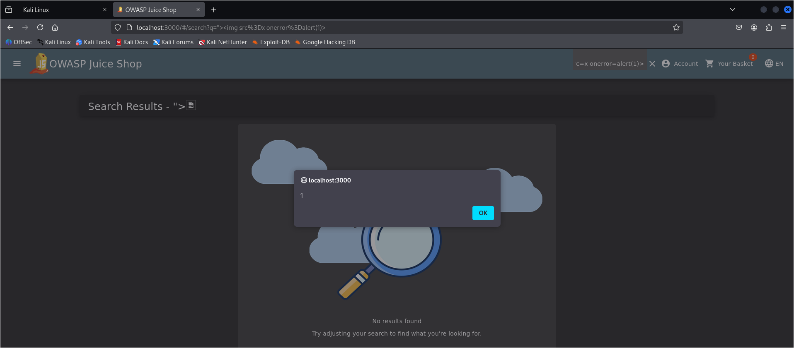

# 🌐 Web Application Security Assessment Lab

## Target Application
OWASP Juice Shop (Running Locally in Controlled Lab Environment)

---

# 🔴 SQL Injection – Authentication Bypass

## 📌 Vulnerability Summary

A SQL Injection vulnerability was identified in the login endpoint of the application.  
Improper input validation allows authentication bypass using crafted SQL payloads.

---

## 🎯 Affected Endpoint

POST /rest/user/login

---

## 🧪 Payload Used

' OR 1=1 --

---

## 📸 Proof of Concept

### 1️⃣ Injected Request


---

### 2️⃣ Server Response (Admin Token Issued)


---

### 3️⃣ Successful Admin Login


---

## 💥 Impact

- Authentication bypass
- Admin account takeover
- Privilege escalation
- Full application compromise

---

## 📊 Risk Rating

Severity: **Critical**  
Estimated CVSS Score: **9.8**

---

## 🛡 Recommended Remediation

- Use parameterized queries
- Implement prepared statements
- Apply ORM protections
- Validate and sanitize user input
- Implement server-side input filtering


---

# 🟠 Cross-Site Scripting (XSS) – DOM-Based Injection

## 📌 Vulnerability Summary

A DOM-based Cross-Site Scripting (XSS) vulnerability was identified in the search functionality of the application. User-controlled input is rendered into the DOM without proper sanitization, allowing arbitrary JavaScript execution in the victim’s browser.

---

## 🎯 Affected Feature

Search functionality (`#/search?q=` parameter)

---

## 🧪 Payload Used

```html
">
```


---

## 📸 Proof of Concept

### 1️⃣ Injected Payload in Search Field



---

### 2️⃣ JavaScript Execution in Browser



---

## 💥 Impact

- Arbitrary JavaScript execution
- Session hijacking
- Cookie theft
- Phishing attack injection
- Account takeover scenarios

---

## 📊 Risk Rating

Severity: **High**  
Estimated CVSS Score: **8.2**

---

## 🛡 Recommended Remediation

- Properly sanitize user input
- Encode output before rendering to DOM
- Implement Content Security Policy (CSP)
- Use secure templating with automatic escaping

